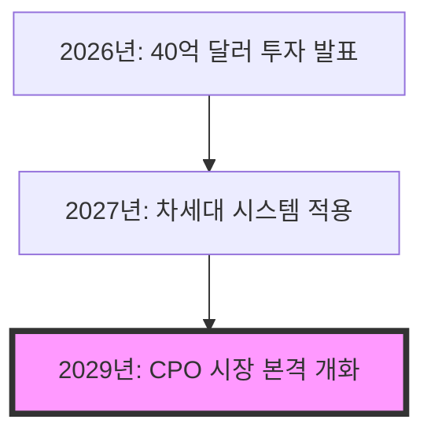

## 핵심 요약
- 엔비디아는 AI 데이터 처리의 물리적 한계를 극복하기 위해 루멘텀과 코히어런트에 <strong>40억 달러 규모의 대규모 투자</strong>를 단행했습니다.
- 광전자 공학 기술은 기존 구리선 대비 <strong>전력 효율을 3.5배 높이고 지연 시간을 98% 단축</strong>하여 AI 인프라의 병목 현상을 해결할 핵심 열쇠로 꼽힙니다.
- 이번 행보는 2029년 본격화될 광학 시장의 주도권을 선점하고 <strong>미국 내 제조 기반과 폐쇄적 생태계</strong>를 강화하려는 장기적인 전략적 포석입니다.

## 주요 내용
엔비디아의 이번 투자는 단순한 자금 지원을 넘어 AI 인프라의 패러다임을 전선(구리)에서 빛(광자)으로 바꾸겠다는 선전포고와 같습니다. 데이터 센터의 전력 소비 폭증과 물리적 연결 공간의 한계를 해결하기 위해 <strong>광학 기술(Photonics)</strong>을 선택한 것입니다. 이는 향후 AI 칩의 성능 경쟁이 계산 속도를 넘어 '데이터 전송 효율'로 이동하고 있음을 시사합니다.

> [!info] 핵심 수치
> - <strong>엔비디아 투자액:</strong> 약 40억 달러 (한화 약 5조 원 이상)
> - <strong>전력 효율 개선:</strong> 기존 대비 3.5배 향상
> - <strong>지연 시간(Latency) 감소:</strong> 약 98% 축소

| 기술 지표 | 기존 방식 (전자) | 광학 방식 (광자) | 개선 효과 |
|---|---:|---:|---:|
| <strong>전력 소비</strong> | 높음 (저항 발생) | 매우 낮음 | <strong>3.5배 효율적</strong> |
| <strong>지연 시간</strong> | 표준 | 최소화 | <strong>98% 단축</strong> |
| <strong>전송 속도</strong> | 물리적 한계 직면 | 빛의 속도 | <strong>비교 불가</strong> |

### 빛의 속도로 이동하는 데이터: CPO와 OCS
엔비디아가 주목한 <strong>공동 패키징 광학(CPO)과 광회선 스위칭(OCS)</strong> 기술은 데이터 전송 속도와 에너지 효율의 혁명을 예고합니다. CPO 기술은 인터넷 공유기 역할을 하는 장치를 칩 바로 위에 통합하여 <strong>전력 소비를 3.5배 줄이며</strong>, OCS는 물리적인 거울을 움직여 빛의 길을 조절함으로써 지연 시간을 제로에 가깝게 만듭니다. 이러한 기술적 도약은 전력 장벽과 해안선 문제로 불리는 칩 외부 연결의 물리적 한계를 동시에 해결하는 유일한 대안입니다.

### 월가의 반응과 장기적 투자 가치
월스트리트 분석가들은 루멘텀과 코히어런트의 <strong>S&P 500 지수 편입 가능성</strong>을 높게 점치며 목표 주가를 일제히 상향 조정했습니다. 루멘텀은 약 15%, 코히어런트는 약 25%의 추가 상승 여력이 있는 것으로 평가받으며, 패시브 자금 유입에 따른 수혜도 기대되는 상황입니다. 본격적인 시장 형성은 2029년으로 예상되나, 엔비디아는 <strong>전환우선주와 보통주 매입</strong>이라는 영리한 방식으로 공급망을 장악하고 경쟁사인 브로드컴과의 '개방형 vs 폐쇄형' 생태계 전쟁에서 우위를 점하려 하고 있습니다.

### AI의 또 다른 갈증: 에너지와 SMR
광학 기술과 더불어 엔비디아 생태계의 핵심 축으로 떠오르는 것은 <strong>소형 모듈 원전(SMR)</strong>입니다. 2030년 AI 데이터 센터의 전력 수요가 일본 한 국가의 연간 사용량과 맞먹는 945TWh에 달할 것으로 예측되면서, 뉴스케일 파워와 같은 기업들이 주목받고 있습니다. 비록 현재는 적자와 소송 리스크를 겪고 있지만, <strong>미국 정부의 유일한 설계 승인</strong>과 미·일 전략 펀드의 250억 달러 규모 잠재적 투자금은 뉴스케일이 '죽음의 소용돌이'를 벗어나 에너지 혁신의 주역이 될 가능성을 뒷받침합니다.

## 결론 / 인사이트
AI 혁명의 전선은 이제 GPU 성능을 넘어 <strong>에너지 공급과 데이터 전송 효율</strong>이라는 물리적 인프라로 확장되었습니다. 엔비디아가 선택한 '빛(광학)'과 'SMR'은 단기적인 유행이 아니라 2030년을 향한 장기 로드맵의 핵심 퍼즐 조각입니다. 투자자들은 당장의 주가 변동에 일희일비하기보다, <strong>미국 내 제조 공급망 강화와 독점적 기술 생태계 구축</strong>이라는 엔비디아의 거대한 설계가 완성되는 과정에 주목해야 합니다.

> 📌 **출처:** [(관심종목) 왜 엔비디아는 빛에 투자하는가?](https://youtu.be/fDoGiB6SAi8?si=pP6jGQAiYqmg73st)
